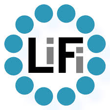
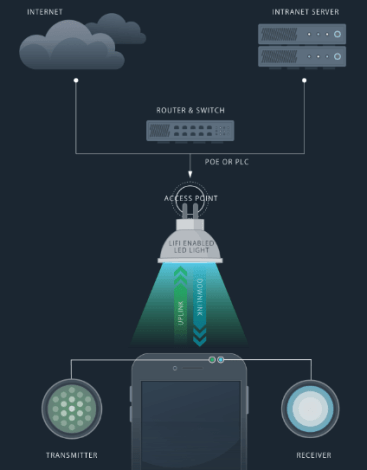

# LIFI ( Light Fidelity )

## Sejarah LiFi ( Light Fidelity )
  Profesor Harald Haas menciptakan istilah "Li-Fi" pada TED Global Talk 2011 di mana dia memperkenalkan gagasan "data nirkabel dari setiap cahaya". Ia adalah Profesor Komunikasi Seluler di Universitas Edinburgh, dan salah satu pendiri pureLiFi bersama dengan Dr Mostafa Afgani. Istilah umum " komunikasi cahaya tampak " (VLC), yang sejarahnya berasal dari tahun 1880-an, termasuk penggunaan bagian cahaya tampak dari spektrum elektromagnetik untuk mengirimkan informasi.

## Pengertian LiFi ( Light Fidelity)
  LiFi Merupakan teknologi nirkabel yang memiliki fungsi tidak jauh berbeda dengan WiFi yaitu teknologi nirkabel dua arah dengan kecepatan tinggi, yang di temukan pertama kali dari hasil percobaan yang dilakukan oleh University College dan University Oxford dengan menggunakan media cahaya untuk mentransfer data dengan kecepatan yang tinggi (kurang lebih 100 Gbps per detik).Perbedaannya dengan Wifi adalah teknologi ini tidak menggunakan frekuensi radio konvensional, tetapi menggunakan gelombang cahaya.

## Cara kerja LiFi ( Light Fidelity )

  Untuk membuat Li-Fi ini bekerja, pertama internet dihubungkan dengan router / switch terlebih dahulu dan switch tersebut dihubungkan dengan bohlam LED yang mendukung LiFi setelah itu perangkat yang digunakan menerima cahaya dari bohlam tersebut dan dapat melakukan transmisi data dari dan ke internet.
membutuhkan dua sumber cahaya yang berada pada masing-masing ujung perangkat,Sumber cahaya yang bisa digunakan yaitu LED atau detektor foto (Light Sensor), Saat cahaya LED menyala cahaya sensor pada ujung perangkat lainnya akan mendeteksinya dan mengartikannya sebagai biner 1.

### Seberapa cepat LiFi ?
LiFi pada saat awal di kembangkan hanya dapat meraih kecepatan 150 Mbps dan sangat lambat dibandingkan dengan WiFi N yang sudah lama beredar luas,Tetapi dengan menggunakan LED yang lebih kuat dan teknologi yang berbeda di sebuah laboratorium mampu meraih kecepatan 10Gbps bahkan mengalahkan WiFi AD yang belum lama beredar.

## Standard LiFi ( Light Fidelity )
  Li-Fi adalah teknologi nirkabel dan menggunakan protokol 802.11 yang serupa, tetapi Li-Fi menggunakan ultraviolet, inframerah dan komunikasi cahaya tampak (bukan gelombang frekuensi radio), yang memiliki bandwidth jauh lebih besar,Satu bagian dari VLC dimodelkan setelah protokol komunikasi yang dibuat oleh kelompok kerja IEEE 802. Namun, standar IEEE 802.15.7 sudah ketinggalan zaman ia gagal untuk mempertimbangkan perkembangan teknologi terbaru dalam bidang komunikasi nirkabel optik, khususnya dengan pengenalan metode modulasi optical orthogonal frequency-division multiplexing (O-OFDM) yang telah dioptimalkan untuk kecepatan data, akses ganda dan efisiensi energi. Pengenalan O-OFDM berarti bahwa drive baru untuk standardisasi komunikasi nirkabel optik diperlukan.
 
### Keuntungan Menggunakan LiFi ( Light Fidelity )
 1. Memiliki kecepatan yang lebih cepat dibandingkan WiFi
 2. Lebis aman karena data tidak dapat diganggu tanpa ada cahaya yang nampak jelas.
 3. Tidak ada lagi inteference antara jaringan seperti yang diterjadi pada WiFi.
 4. Memilki 2 kegunaan sekaligus yaitu untuk menerangkan dan mentransmisikan data.
 5. Keunggulan lain dari teknologi Li-Fi adalah mampu mengurangi polusi elektromagnetik yang dihasilkan oleh gelombang radio.

 kekurangan LiFi ( Light Fidelity )
  1. Kurangnya Mobilitas.
  2. Cakupan Jaringan yang Sempit.
  3. Tidak Bisa Menembus Dinding.
  4. Memerlukan Sumber Cahaya Optimal.
  
### Kelemahan dan Tantangan Li-Fi ( Light Fidelity )
  Meski memiliki banyak keunggulan teknologi Li-Fi juga masih memiliki beberapa kelemahan dibanding sistem Wi-Fi konvensional. Li-Fi yang diterapkan secara base station pada langit-langit ruangan ini membutuhkan direct line of sight atau “pandangan” langsung ke perangkat tujuan. Direct line ini ternyata juga harus dilengkapi receiver khusus, seperti koneksi infra red pada gadget jadul Selain itu, perangkat tujuan ini harus tidak boleh dipindah-pindahkan.  
Dari perkembangan yang ada, teknologi Li-Fi juga menyimpan banyak tantangan antara lain membutuhkan line-of-sight yang sempurna untuk mengirimkan data. Tantangan berat lainnya yaitu cara mengirimkan kembali data ke pemancar secara optimal.
 
 
 
 REFERENSI
 
  https://tekno.foresteract.com/lifi/
  https://en.m.wikipedia.org/wiki/Li-Fi
  https://unida.ac.id/teknologi/artikel/li-fi.html
  https://ee.uii.ac.id/2020/06/01/mengenal-teknologi-li-fi-light-fidelity/
  https://getective.com/apa-yang-dimaksud-dengan-lifi/

